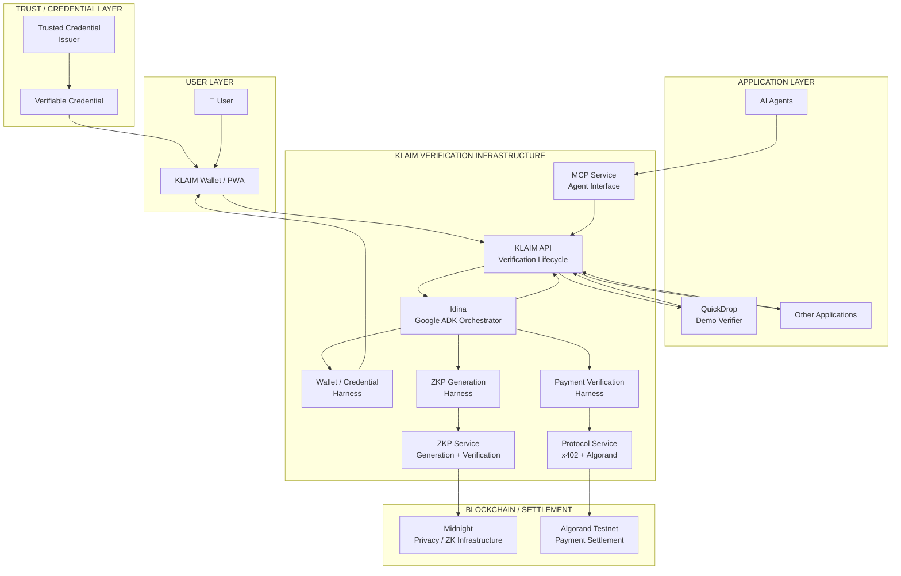
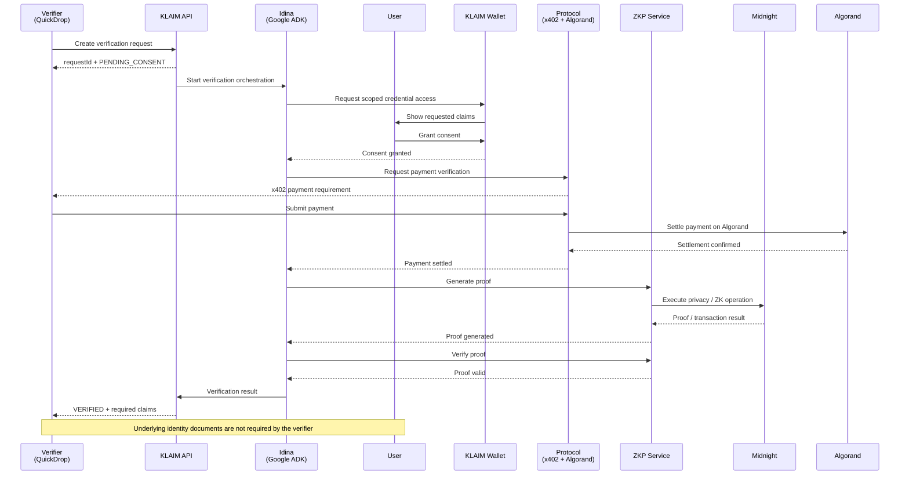
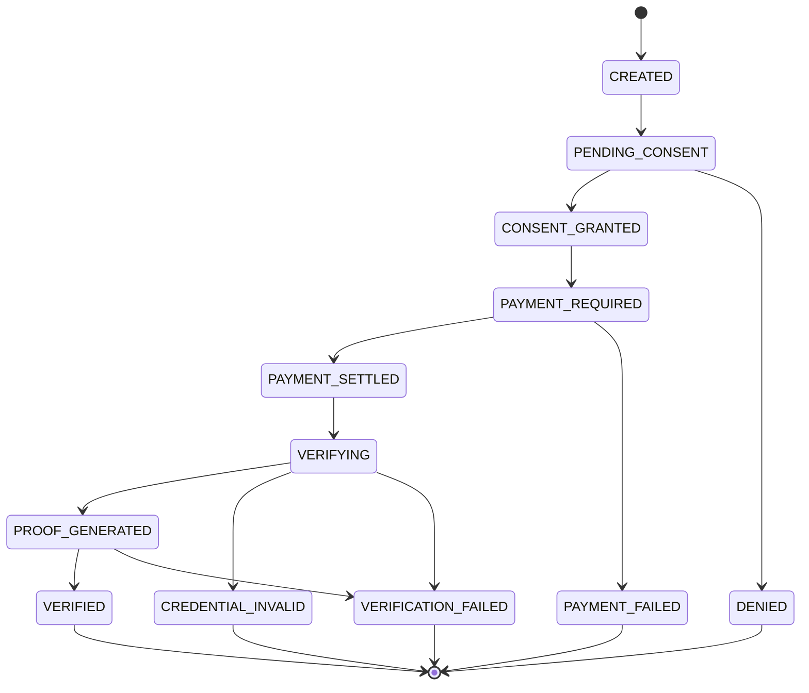
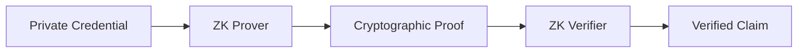
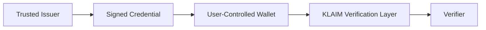
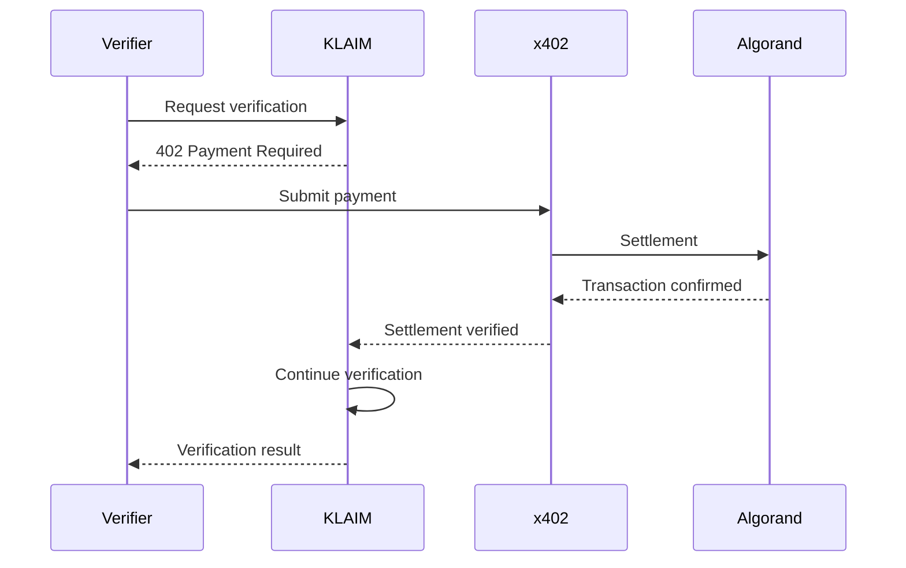
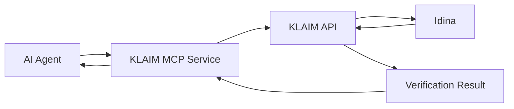
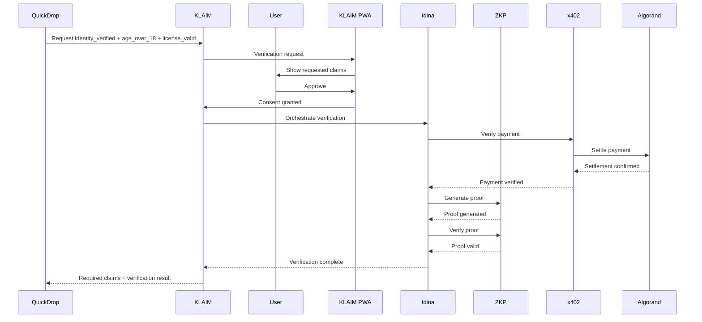
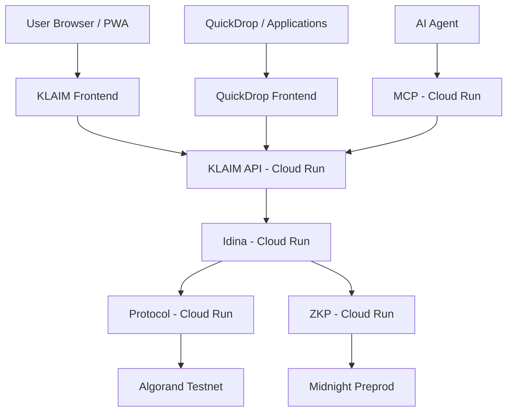

# KLAIM

### Privacy-first identity verification infrastructure for applications, organizations, and AI agents.

KLAIM enables applications, organizations, and AI agents to verify **specific user claims without requiring access to the user's underlying identity documents**.

Instead of asking a user to upload an entire identity document just to answer a single question such as:

> **"Is this user over 18?"**

KLAIM allows a verifier to request only the claims it needs, lets the user explicitly consent, and returns a privacy-preserving verification result.

---


https://github.com/user-attachments/assets/43ff49d2-5518-49a9-8ec9-1702fcbf7f9e


## ✨ Why KLAIM?

Digital services increasingly need identity verification.

A platform may need to know:

- Is this person a verified individual?
- Is the user over 18?
- Is a driving licence valid?
- Is an identity credential valid?

But the application often does **not** need the user's entire identity document.

Traditional flow:

```text
User
  │
  ▼
Upload Identity Document
  │
  ▼
Application receives sensitive PII
  │
  ▼
Application processes / stores the document
````

KLAIM changes this into:

```text
User Credential
      │
      ▼
KLAIM Wallet
      │
      ▼
User Consent
      │
      ▼
Claim Verification
      │
      ▼
Privacy-Preserving Proof
      │
      ▼
Verifier receives the required claim
```

### Core principle

> **Verify the claim, not the entire identity.**


# 🎯 What KLAIM Solves

KLAIM acts as a verification infrastructure layer between trusted credentials and the applications that need to consume them.

```text
                 TRUSTED ECOSYSTEM
                       │
                       ▼
              Credential Issuers
                       │
                       ▼
               User Credentials
                       │
                       ▼
              KLAIM Wallet / PWA
                       │
                 User Consent
                       │
                       ▼
              KLAIM Verification
                       │
          ┌────────────┴────────────┐
          ▼                         ▼
    Applications                AI Agents
     / Services                   / MCP
```

The verifier receives the **minimum information required for the task**, rather than unnecessarily receiving the user's underlying identity documents.

---

# 🏗️ Overall Architecture



---

# 🔄 End-to-End Sequential Flow

The complete KLAIM verification flow:



---

# 🔐 Verification Lifecycle

Every verification request follows an explicit state machine.



### Critical security invariant

```text
NO PAYMENT SETTLEMENT
        ↓
NO VERIFICATION
```

A frontend acknowledgement, payment intent, or HTTP 402 response is not treated as successful settlement.

The backend requires actual payment settlement before verification proceeds.

---

# 🧠 Idina — Verification Orchestration

**Idina** is KLAIM's verification orchestration microservice built using **Google ADK**.

Idina coordinates the verification workflow while security-critical operations remain inside deterministic services.

## Three Harnesses

### 1. Wallet / Credential Access

Provides scoped access to the user's credential or identity wallet after consent.

```text
Verification Request
        ↓
User Consent
        ↓
Wallet / Credential Harness
        ↓
Credential Context
```

### 2. Payment Verification

Coordinates payment verification and settlement status.

```text
Verification
      ↓
Payment Required
      ↓
x402
      ↓
Algorand Settlement
      ↓
Payment Confirmed
```

### 3. ZKP Generation

Coordinates proof generation through the dedicated ZKP service.

```text
Credential Context
      ↓
ZKP Harness
      ↓
ZKP Service
      ↓
Proof
```

### Design Principle

> **AI orchestrates. Deterministic services execute.**

Idina should not:

* Invent claims
* Fabricate payment settlement
* Decide that an invalid proof is valid
* Replace cryptographic verification
* Directly manipulate security-critical blockchain state

---

# 🔏 Zero-Knowledge Verification

KLAIM's privacy model is based on verifying claims without unnecessarily exposing the underlying identity information.

For example, a verifier may only need:

```json
{
  "age_over_18": true
}
```

instead of receiving:

```text
Full Name
Date of Birth
Government ID Number
Identity Document
Address
Document Image
```

Conceptually:



---

# 🛡️ What Does the Verifier Receive?

The verifier should receive the minimum information required for the requested verification.

Conceptually:

```json
{
  "requestId": "REQ-123",
  "status": "VERIFIED",
  "claims": {
    "age_over_18": true,
    "license_valid": true
  },
  "proof": {
    "proofId": "proof-123"
  },
  "credentialStatus": "valid"
}
```

The exact response depends on the active credential and proof implementation.

### The verifier should NOT need:

```text
❌ Full identity document
❌ Government ID number
❌ Complete date of birth
❌ Document image
❌ Unnecessary personal information
```

### Instead, the verifier receives:

```text
✓ Requested claim
✓ Verification result
✓ Proof / verification metadata
✓ Credential / issuer validity context where applicable
```

---

# 🔗 Trust Model

KLAIM is **not the root of trust**.

The trust model is:



The credential issuer provides the authority behind the credential.

KLAIM provides the infrastructure to consume and verify the requested claims.

This prevents the system from relying on a simple assertion such as:

```json
{
  "age_over_18": true
}
```

without an underlying credential/proof verification process.

---

# 🌐 Midnight

KLAIM integrates its privacy/ZK layer with the **Midnight ecosystem**.

The role of Midnight is related to privacy-preserving computation and zero-knowledge infrastructure.

The architecture separates:

```text
ZKP Generation
      ↓
ZKP Verification
      ↓
On-chain / network activity where applicable
```

### Midnight Preprod Activity

The KLAIM Activity interface can expose relevant Midnight Preprod transaction activity, allowing users and judges to inspect the corresponding transaction information.

Example transaction hashes used during development/demo:

```text
f02ec26e5743f8426bb587b4b3af2c711675d0a9f459d563a880e6d7bdf1b7c8

6f24cd406de9bb210c40a7c6a68713a583fd1ef517e5361f8b1caf5ee7254987

bd7fde447711892c7c5f6c19a72bf706dbf1a827e79217160268e88f2b35e047
```

> Transaction hashes represent blockchain/network activity and should not be confused with ZK proof IDs.

---

# 💰 x402 + Algorand

KLAIM uses **x402** as the pay-per-verification payment mechanism.



### Why pay-per-verification?

Verification can be treated as an infrastructure operation rather than requiring every organization to build and maintain its own identity verification stack.

x402 provides a protocol-level mechanism for charging for individual verification operations.

---

# 🤖 MCP — AI Agent Interface

KLAIM exposes its verification infrastructure to AI agents through **Model Context Protocol (MCP)**.



Example capabilities:

```text
verify_age
verify_identity
verify_license
get_verification_status
```

MCP is an interface into KLAIM's verification infrastructure.

It does not create a second verification engine.

---

# 📱 KLAIM PWA

The KLAIM PWA provides the user-facing identity and consent experience.

It includes:

* Verification requests
* Consent management
* Identity overview
* Credentials
* Activity
* Transaction activity
* Verification results
* Settings

The user remains in control of whether a verifier can proceed with the requested claims.

---

# 🧑‍💻 Example Application Flow

QuickDrop is used as a demonstration verifier.



---

# 📡 API

## Create Verification Request

```http
POST /api/verification-requests
```

Example:

```json
{
  "verifierId": "quickdrop-demo",
  "userDid": "did:identipi:demo-user-001",
  "claims": [
    "identity_verified",
    "age_over_18",
    "license_valid"
  ]
}
```

Response:

```json
{
  "requestId": "REQ-123",
  "status": "PENDING_CONSENT"
}
```

---

## Grant Consent

```http
POST /api/verification-requests/:id/consent
```

```json
{
  "decision": "ALLOW"
}
```

or:

```json
{
  "decision": "DENY"
}
```

---

## Get Verification Status

```http
GET /api/verification-requests/:id
```

Example:

```json
{
  "requestId": "REQ-123",
  "status": "VERIFYING"
}
```

---

## Get Verification Result

```http
GET /api/verification-requests/:id/result
```

Example:

```json
{
  "requestId": "REQ-123",
  "status": "VERIFIED",
  "claims": {
    "identity_verified": true,
    "age_over_18": true,
    "license_valid": true
  },
  "proofId": "proof-123",
  "txId": "ALG_TX_ID"
}
```

---

# 🧱 Service Architecture

KLAIM is organized into independently deployable application and service boundaries.

```text
KLAIM/
│
├── frontend/
│   ├── klaim/
│   │   └── User Wallet / PWA
│   │
│   └── quickdrop/
│       └── Demo Verifier
│
├── backend/
│   └── klaim-api/
│       └── Core Verification API
│
├── services/
│   ├── idina/
│   │   └── Google ADK Orchestration
│   │
│   ├── protocol/
│   │   └── x402 + Algorand
│   │
│   ├── zkp/
│   │   └── ZK Proof Infrastructure
│   │
│   └── mcp/
│       └── AI Agent Interface
│
├── packages/
│   ├── types/
│   ├── contracts/
│   └── utils/
│
├── docs/
│   ├── ARCHITECTURE.md
│   ├── API_CONTRACT.md
│   ├── SERVICE_CONTRACTS.md
│   ├── DEPLOYMENT.md
│   ├── TEAM_OWNERSHIP.md
│   ├── EXISTING_SYSTEM.md
│   ├── MIGRATION_PLAN.md
│   └── STATE_MACHINE.md
│
└── infra/
    ├── docker/
    └── gcp/
```

---

# ☁️ Deployment Architecture

KLAIM is deployed using **Google Cloud Run**.



---

# 🧰 Technology Stack

## Frontend

* React
* TypeScript
* Vite
* Tailwind CSS
* Progressive Web App (PWA)

## Backend

* Node.js
* TypeScript
* REST APIs
* Microservices

## AI & Agent Orchestration

* Google ADK
* Gemini
* Vertex AI
* Idina
* Model Context Protocol (MCP)

## Identity & Privacy

* Decentralized Identity
* Verifiable Credentials
* Zero-Knowledge Proofs
* Midnight
* Selective Disclosure

## Blockchain & Payments

* Algorand
* Algorand Testnet
* x402
* USDC

## Infrastructure

* Docker
* Google Cloud Run
* Google Cloud
* GitHub

---

# 🧪 Current Implementation

KLAIM currently demonstrates:

* [x] KLAIM verification API
* [x] Explicit verification lifecycle
* [x] User consent flow
* [x] KLAIM identity wallet / PWA
* [x] QuickDrop verifier application
* [x] Idina orchestration service
* [x] Wallet / credential harness
* [x] Payment verification harness
* [x] ZKP generation harness
* [x] x402 payment flow
* [x] Algorand Testnet settlement
* [x] MCP interface
* [x] Cloud Run deployment
* [x] Microservice architecture
* [x] End-to-end verification workflow
* [x] Midnight Preprod activity integration where applicable

---

# 🔍 Security Principles

### 1. User Consent

A verifier cannot silently request unrestricted access to the user's identity.

### 2. Minimum Disclosure

Only the claims required by the verifier should be returned.

### 3. Separation of Concerns

AI orchestration, payment settlement, credential handling, and cryptographic operations are separated into dedicated services.

### 4. No Settlement → No Verification

Payment state is verified independently before verification proceeds.

### 5. Verifier-Side Trust

The verifier should validate the proof, credential/issuer context, and applicable verification policy rather than blindly trusting a boolean returned by KLAIM.

### 6. No False Trust Claims

KLAIM does not claim to be the authority that issued a user's identity. Trusted issuers remain the source of credential authority.

---

# 📈 Scalability

KLAIM is designed as a modular verification infrastructure layer.

Potential use cases include:

```text
FinTech
   │
   ├── Age verification
   ├── Identity verification
   └── KYC workflows

Hiring
   │
   ├── Credential verification
   ├── Qualification verification
   └── Employee onboarding

Education
   │
   ├── Student credentials
   ├── Certificate verification
   └── Age / eligibility verification

Marketplaces
   │
   ├── Seller verification
   ├── Driver verification
   └── Worker verification

AI Agents
   │
   ├── Age verification
   ├── Identity verification
   └── Permissioned claim verification
```

The same KLAIM API can be consumed by multiple types of applications without each application implementing its own complete identity verification infrastructure.

---

# 🌍 Vision

KLAIM does not aim to replace governments, credential issuers, or existing identity ecosystems.

Instead, KLAIM aims to provide a common **verification rail** between trusted credentials and applications that need to consume them.

The long-term model is:

```text
Trusted Issuers
      ↓
Credentials
      ↓
User-Controlled Identity
      ↓
KLAIM Verification Rail
      ↓
┌───────────────┬────────────────┐
│               │                │
▼               ▼                ▼
Applications   Organizations   AI Agents
```

### India-first. Globally interoperable.

The vision is to make identity verification as consumable as an infrastructure API while preserving user control and minimizing unnecessary disclosure.

---

# 🏆 Why KLAIM?

Traditional identity verification often asks:

> **"Give me your identity document so I can verify you."**

KLAIM asks:

> **"What claim do you need verified?"**

Then it builds the verification flow around that specific requirement.

```text
Request only what you need.
Verify only what you need.
Share only what you need.
```

---

# 👥 Team

Built by the KLAIM team.

---

# 📜 License

See the repository license for details.

```
```
